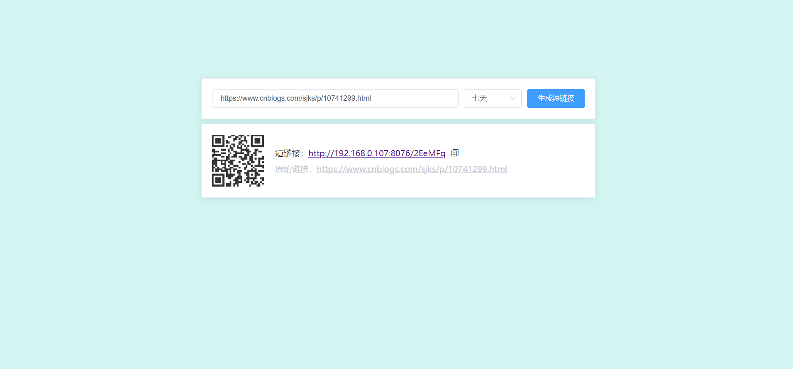

# bluewind-shorturl
# 短链接生成器

将长链接转换成短链接，访问短链接时， 302重定向至原始长链接，支持设置有效期，支持记录访问次数

| 依赖        | 说明                  |
| ----------- | ---------------------|
| Spring Boot | MVC 框架             |
| thymeleaf   | 模板引擎              |
| JdbcTemplate| 持久层 框架           |
| Redis       | 缓存                  |
| guava       | Hash 算法、布隆过滤器 |

